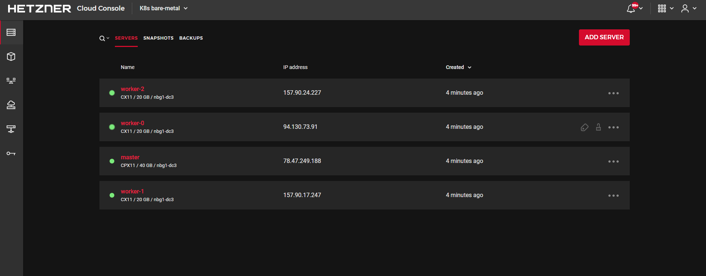

# k8s-hetzner-cloud

Kubernetes Terraform installer for Hetzner bare-metal.



### Initial setup

Clone the repository and install the dependencies:

```bash
$ git clone https://github.com/felipecruz91/k8s-hetzner.git
$ cd k8s-hetzner
$ terraform init
```

Note that you'll need Terraform v0.13 or newer to run this project.

Note that, before running the project, you'll have to create an access token for Terraform to connect to the Hetzner Cloud API.

Once you have the token, create the `hetzner-api-token.txt` file and paste it in there.

Using the token, create the `TF_VAR_hcloud_token` environment variable:

```bash
$ export TF_VAR_hcloud_token=$(cat hetzner-api-token.txt)
```
You also need to make sure the your local path `~/.ssh/id_rsa.pub` contains a public key. You can generate it as 
follows if you dont already have it 

```bash
$ cd ~/.ssh \
    ssh-keygen -t rsa -C "your-email-adress@somewhere.com"
```
The prompt will ask you which file name you want to save the ssh key file, you can leave it empty to use the default 
one, and afterwards type in the passwords. 

### Building the Kubernetes VM image with Packer

```cli
$ cd images && \
    packer build image-master.json
```
Take note of the output image ids for `image-master.json` and `image-master-containerd.json` and paste them in `main.
tf`: `data "hcloud_image" "k8s_image"` and `data "hcloud_image" "k8s_image_containerd"` respectively. 

### Usage

Create a bare-metal Kubernetes cluster with one master and 3 worker nodes:

```bash
$ terraform apply \
 -var master_location=nbg1 \
 -var master_server_type=cpx11 \
 -var worker_nodes_count=3 \
 -var worker_server_type=cx11 \
 -var worker_location=nbg1
```

This will do the following:

- provisions three bare-metal servers with Ubuntu 18.04 LTS (the size of the `master` and the `node` may be different but must remain in the same type of architecture)
- connects to the master server via SSH and installs Docker CE and kubeadm apt packages
- runs kubeadm init on the master server and configures kubectl
- downloads the kubectl admin config file on your local machine and replaces the private IP with the public one
- creates a Kubernetes secret with the Weave Net password
- installs Weave Net with encrypted overlay
- starts the nodes in parallel and installs Docker CE and kubeadm
- joins the nodes in the cluster using the kubeadm token obtained from the master

Scale up by increasing the number of nodes:

```bash
$ terraform apply \
 -var worker_nodes_count=4
```

Tear down the whole infrastructure with:

```bash
terraform destroy -force
```

### Remote control

After applying the Terraform plan you'll see several output variables like the master public IP,
the kubeadm join command and the current workspace admin config.

In order to run `kubectl` commands against the Hetzner cluster you can use the `kubectl_config` output variable:

```bash
$ export KUBECONFIG="$(pwd)/$(terraform output kubectl_config)"
```

```bash
$ kubectl --insecure-skip-tls-verify get nodes -o wide

NAME       STATUS   ROLES    AGE     VERSION   INTERNAL-IP     EXTERNAL-IP   OS-IMAGE             KERNEL-VERSION       CONTAINER-RUNTIME
master     Ready    master   3m45s   v1.19.5   78.47.249.188   <none>        Ubuntu 18.04.5 LTS   4.15.0-124-generic   docker://19.3.6
worker-0   Ready    <none>   3m28s   v1.19.5   94.130.73.91    <none>        Ubuntu 18.04.5 LTS   4.15.0-124-generic   docker://19.3.6
worker-1   Ready    <none>   3m23s   v1.19.5   157.90.17.247   <none>        Ubuntu 18.04.5 LTS   4.15.0-124-generic   docker://19.3.6
worker-2   Ready    <none>   3m26s   v1.19.5   157.90.24.227   <none>        Ubuntu 18.04.5 LTS   4.15.0-124-generic   docker://19.3.6
```
